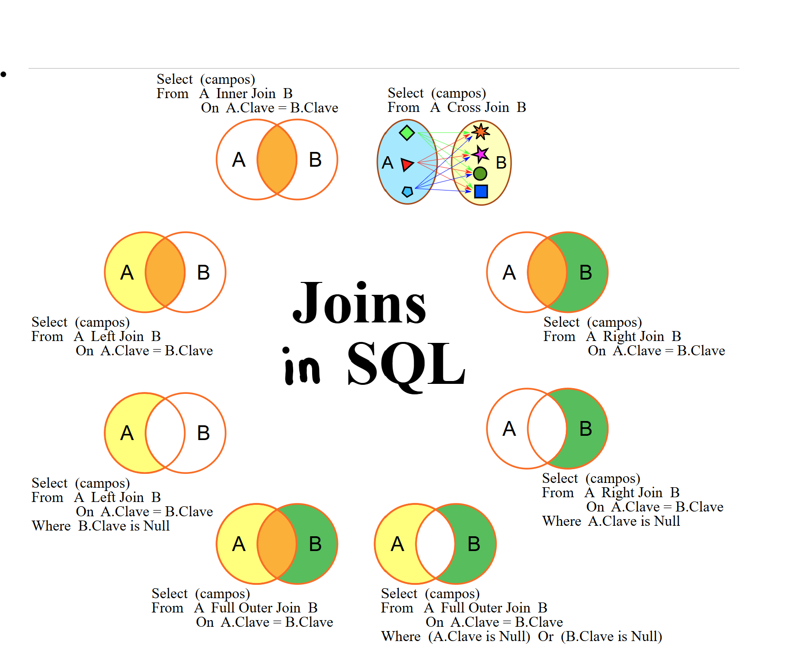

# 📘 SQL Cheatsheet — Beginner to Advanced

## 🧠 Core Concepts

1. **Database** – A collection of data organized to accelerate retrieval, transformation, and analytics.
2. **Schema** – Logical grouping of database objects (tables, views, indexes).
3. **Table** – Organized data structure of rows and columns.
4. **Constraints** – Rules to maintain data integrity (e.g., primary key, not null).

---

## ✅ Best Practices

- Use meaningful and consistent naming conventions.
- Avoid reserved SQL keywords in names.
- Prefer snake_case or camelCase consistently.

---

## 🧪 Sample Table

```sql
CREATE TABLE carPurchaseLog (
    purchase_date DATETIME,
    transaction_id INT PRIMARY KEY,
    price FLOAT,
    agent_name VARCHAR(100)
);
```

| purchase_date       | transaction_id | price     | agent_name |
|---------------------|----------------|-----------|------------|
| 2019-03-01 10:00:00 | 123            | 30015.50  | Jane       |
| 2019-03-01 10:30:00 | 234            | 25006.00  | Doe        |

---

## 🔹 Basic SQL Queries

```sql
-- Create & Use DB
CREATE DATABASE carLibrary;
USE carLibrary;

-- Create Schema
CREATE SCHEMA carLogs;

-- Create Table
CREATE TABLE carPurchaseLog (
    purchase_date DATE,
    transaction_id INT PRIMARY KEY,
    price FLOAT,
    agent_name VARCHAR(100)
);

-- View Data
SELECT * FROM carPurchaseLog;
SELECT * FROM carPurchaseLog WHERE purchase_date > '2022-01-01';

-- Insert Data
INSERT INTO carPurchaseLog VALUES
('2019-03-01 10:00:00', 123, 30015.50, 'Jane'),
('2019-03-01 10:30:00', 234, 25006.00, 'Doe');

-- Drop Table and DB
DROP TABLE carPurchaseLog;
DROP DATABASE carLibrary;
```

---

## 🔧 Data Manipulation

```sql
-- NULL Check
SELECT * FROM carPurchaseLog WHERE price IS NOT NULL;

-- Update
UPDATE carPurchaseLog SET agent_name = 'Mini' WHERE transaction_id = 123;

-- Delete
DELETE FROM carPurchaseLog WHERE agent_name = 'Mini';

-- Alter Table
ALTER TABLE carPurchaseLog 
ADD customer_phone BIGINT,
ADD customer_email VARCHAR(100);

ALTER TABLE carPurchaseLog
MODIFY customer_email VARCHAR(150);

ALTER TABLE carPurchaseLog
CHANGE customer_email cust_email VARCHAR(150);

ALTER TABLE carPurchaseLog
DROP COLUMN cust_email,
DROP COLUMN customer_phone;
```

---

## 📌 Constraints

```sql
-- Primary Key
CREATE TABLE users (
    id INT PRIMARY KEY,
    name VARCHAR(100)
);

-- Foreign Key
CREATE TABLE orders (
    order_id INT PRIMARY KEY,
    user_id INT,
    FOREIGN KEY (user_id) REFERENCES users(id)
);

-- Composite Key
CREATE TABLE attendance (
    student_id INT,
    course_id INT,
    PRIMARY KEY (student_id, course_id)
);

-- Unique
CREATE TABLE agents (
    id INT PRIMARY KEY,
    email VARCHAR(100) UNIQUE
);

-- NOT NULL
CREATE TABLE products (
    id INT PRIMARY KEY,
    name VARCHAR(100) NOT NULL
);

-- Auto Increment
CREATE TABLE invoices (
    id INT AUTO_INCREMENT PRIMARY KEY,
    amount FLOAT
);

-- Check
CREATE TABLE employees (
    id INT PRIMARY KEY,
    dob DATE CHECK (dob > '1900-01-01')
);

-- Default
CREATE TABLE salaries (
    id INT PRIMARY KEY,
    amount FLOAT DEFAULT 10000
);
```

---

## 🧩 Index vs Views

```sql
-- Index
CREATE INDEX idx_name ON agents(email);
SELECT * FROM agents WHERE email = 'test@example.com';
ALTER TABLE agents DROP INDEX idx_name;

-- View
CREATE VIEW agent_summary AS
SELECT agent_name, COUNT(*) AS total_sales
FROM carPurchaseLog
GROUP BY agent_name;
```

> **Index**: Speeds up retrieval, slower writes  
> **View**: Virtual table from query result, read-only abstraction

---

## 🔗 Joins

   

```sql
-- Inner Join (extract rows where id columns in both tables match)
SELECT * FROM users u
INNER JOIN orders o ON u.id = o.user_id;

-- Left Join 
SELECT * FROM users u
LEFT JOIN orders o ON u.id = o.user_id;

-- Right Join
SELECT * FROM users u
RIGHT JOIN orders o ON u.id = o.user_id;

-- Full Join (if supported)
SELECT * FROM users u
FULL OUTER JOIN orders o ON u.id = o.user_id;

-- Cross Join - creates all possible combinations (many to many mapping)
SELECT * FROM users u
CROSS JOIN orders o;

-- Natural Join (a type of inner join but only the common columns are retained. ie, not all the columns that are mutually exclusive to either tables)
SELECT * FROM users
NATURAL JOIN orders;
```

---

## 📏 Aggregation & Grouping

```sql
-- Aggregates
SELECT COUNT(*) FROM carPurchaseLog;
SELECT AVG(price) FROM carPurchaseLog;
SELECT MIN(price), MAX(price) FROM carPurchaseLog;

-- Group By
SELECT agent_name, COUNT(*) AS total_sales, SUM(price) AS total_revenue
FROM carPurchaseLog
GROUP BY agent_name;

-- Having
SELECT agent_name, COUNT(*) AS total_sales
FROM carPurchaseLog
GROUP BY agent_name
HAVING total_sales > 1;
```

---

## Case & If-Else
**🔹 CASE** 
```sql
-- Example: Label sales into categories
SELECT transaction_id, price,
  CASE 
    WHEN price > 30000 THEN 'High'
    WHEN price BETWEEN 20000 AND 30000 THEN 'Medium'
    ELSE 'Low'
  END AS price_category
FROM carPurchaseLog;
```

**🔹 IF-ELSE** 
```sql
-- only used inside stored procedures
CREATE PROCEDURE CheckPrice(IN price_input FLOAT)
BEGIN
  IF price_input > 30000 THEN
    SELECT 'High Value';
  ELSEIF price_input BETWEEN 20000 AND 30000 THEN
    SELECT 'Medium Value';
  ELSE
    SELECT 'Low Value';
  END IF;
END;

CALL CheckPrice(25000);
```

**🔹 WHILE** 
```sql
CREATE PROCEDURE CountDown()
BEGIN
  DECLARE counter INT DEFAULT 5;
  WHILE counter > 0 DO
    SELECT CONCAT('Countdown: ', counter);
    SET counter = counter - 1;
  END WHILE;
END;

CALL CountDown();
```

**🔹 LOOP** 
```sql
-- An infinite loop unless terminated with LEAVE.
CREATE PROCEDURE SimpleLoop()
BEGIN
  DECLARE i INT DEFAULT 1;
  loop_label: LOOP
    IF i > 3 THEN
      LEAVE loop_label;
    END IF;
    SELECT CONCAT('Iteration ', i);
    SET i = i + 1;
  END LOOP;
END ;

CALL SimpleLoop();
```

**🔹 REPEAT UNTIL** 
```sql
-- Similar to do...while. Executes the block at least once.
CREATE PROCEDURE RepeatExample()
BEGIN
  DECLARE i INT DEFAULT 1;
  REPEAT
    SELECT CONCAT('Repeat Iteration ', i);
    SET i = i + 1;
  UNTIL i > 3
  END REPEAT;
END;

CALL RepeatExample();
```


---

## 📆 Date & Time

```sql
-- Extract parts
SELECT YEAR(purchase_date), MONTH(purchase_date) FROM carPurchaseLog;

-- Format
SELECT DATE_FORMAT(purchase_date, '%Y-%m') AS formatted_date FROM carPurchaseLog;

-- Filter range
SELECT * FROM carPurchaseLog
WHERE purchase_date BETWEEN '2019-01-01' AND '2020-01-01';

-- Convert timezone (MySQL)
SELECT CONVERT_TZ(purchase_date, 'UTC', 'US/Pacific') FROM carPurchaseLog;
```

---

## 🎯 Distinct & Order

```sql
-- Distinct
SELECT DISTINCT agent_name FROM carPurchaseLog;

-- Order By
SELECT * FROM carPurchaseLog ORDER BY price DESC;
```

---

## 🪟 Window Functions

What is a Window Function in SQL?
A **window function** performs calculations across a "window" (subset) of rows that are related to the current row — **without collapsing** the result into a single row (unlike `GROUP BY`).

---

#### 🧠 Key Concepts

- `OVER()` — defines the window (i.e., the rows to compare with).
- You can **partition** rows (like GROUP BY) and **order** them too.
- Common use cases: rankings, running totals, moving averages, percentiles.


```sql
-- Rank agents by number of sales
SELECT agent_name, COUNT(*) AS sales,
       RANK() OVER (ORDER BY COUNT(*) DESC) AS rank
FROM carPurchaseLog
GROUP BY agent_name;

-- Running total
SELECT purchase_date, price,
       SUM(price) OVER (ORDER BY purchase_date) AS running_total
FROM carPurchaseLog;

-- Row number using Partition
SELECT *, ROW_NUMBER() OVER (PARTITION BY agent_name ORDER BY purchase_date) AS row_num
FROM carPurchaseLog;
```

---

## ⚙️ Stored Procedures

A stored procedure is a named block of SQL code saved in the database. It allows you to reuse logic, reduce repetitive queries, and improve performance by reducing client-server round trips.

Stored procedures support parameters of three types:

| Type    | Description                                           |
|---------|-------------------------------------------------------|
| IN      | Passes a value into the procedure (default)           |
| OUT     | Returns a value from the procedure                    |
| INOUT   | Accepts a value, modifies it, and returns it back     |

Why use stored procedures?
- 📦 Reusability: Centralize common logic once and reuse it anywhere.
- 🚀 Performance: Reduce data traffic between application and server.
- 🔒 Security: Give users access to procedures without exposing raw data.


**🔹 IN** 
```sql
-- IN: Takes an input value and uses it inside the procedure
CREATE PROCEDURE GetAgentSales(IN agent_name_input VARCHAR(100))
BEGIN
  SELECT * FROM carPurchaseLog
  WHERE agent_name = agent_name_input;
END ;

CALL GetAgentSales('Jane');
```

**🔹 OUT** 
```sql
-- OUT: Outputs a value from within the procedure
CREATE PROCEDURE GetTransactionCount(OUT total INT)
BEGIN
  SELECT COUNT(*) INTO total FROM carPurchaseLog;
END;

CALL GetTransactionCount(@total);
SELECT @total;
```

**🔹 INOUT** 
```sql

-- INOUT: Accepts a value, modifies it, and returns the result
CREATE PROCEDURE AdjustPrice(INOUT price_input FLOAT)
BEGIN
  SET price_input = price_input * 1.10;
END ;

SET @price = 10000;
CALL AdjustPrice(@price);
SELECT @price;  -- returns 11000
```

## ⚠️ Error Handling in Stored Procedures

SQL allows **error handling inside procedures** using `DECLARE HANDLER`. You can gracefully handle exceptions like invalid data, null values, or failed queries.

---

### 🔹 Types of Handlers

| Type     | Description                                                                 |
|----------|-----------------------------------------------------------------------------|
| `CONTINUE` | Skip the error and continue with the next statement                        |
| `EXIT`     | Exit the procedure/block immediately when an error occurs                  |

---

**🔹 EXIT handler (exit on error)** 

```sql
CREATE PROCEDURE InsertWithCheck(IN id_input INT)
BEGIN
  DECLARE CONTINUE HANDLER FOR SQLEXCEPTION
  BEGIN
    SELECT 'Error occurred. Procedure exiting.' AS error_msg;   -- Handles any SQL exception and prevents a full crash
  END;

  INSERT INTO test_table(id) VALUES (id_input); -- May violate PK
END;

CALL InsertWithCheck(1);
```

**🔹 CONTINUE handler (log error and keep going)**
```sql
CREATE PROCEDURE SafeInsertLoop()
BEGIN
  DECLARE CONTINUE HANDLER FOR SQLEXCEPTION
  BEGIN
    INSERT INTO error_log(msg) VALUES ('Failed to insert record.');
  END;

  DECLARE i INT DEFAULT 1;

  WHILE i <= 3 DO
    INSERT INTO test_table(id) VALUES (1); -- Duplicate ID. Logs the error and continues executing the loop.
    SET i = i + 1;
  END WHILE;
END ;

CALL SafeInsertLoop();
```