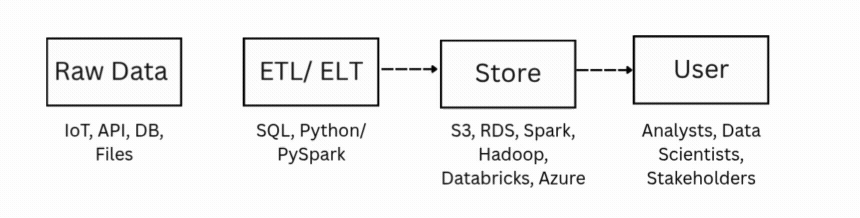

# 📊 Data Engineering for Dummies

Hey there — I’m building this repo as a hands-on, beginner-to-intermediate guide to Data Engineering. If you're just getting started or want to brush up on the basics, you're in the right place.

I’m using this as my own learning log and sharing it so others can benefit too. We’ll explore everything from SQL to streaming to cloud tools — mostly using **GCP** and **Azure**.

## Data Pipleline

   

---

## 🛣️ Learning Roadmap

### 📌 Foundation
1. **SQL** – Queries, joins, windows, CTEs, performance
2. **Python + PySpark** – Python basics → Distributed computing with PySpark

3. **Big Data Concepts (GCP)**
4. **Hadoop Ecosystem**
  4.1 HDFS (Storage)
  4.2 MapReduce (Processing)
  4.3 YARN (Resource Management)
5. **Apache Spark**
  5.1 Spark SQL
  5.2 Caching
  5.3 Spark Joins
6. **Hive**
  6.1 Hive Query Language (HQL)
7. **⚡Kafka**
  7.1 Kafka Basics
  7.2 Spark Streaming
8. **Docker** – Build & run containerized environments
9. **🔄Airflow**
  9.1 DAGs and scheduling
  9.2 Astro (Cloud Airflow)
10. **☁️ Databricks** – Spark workloads
11. **Azure Cloud** – Cloud setup and tools

### 🚀 Final Project
- **Capstone Project** – Build a real-world end-to-end data pipeline

